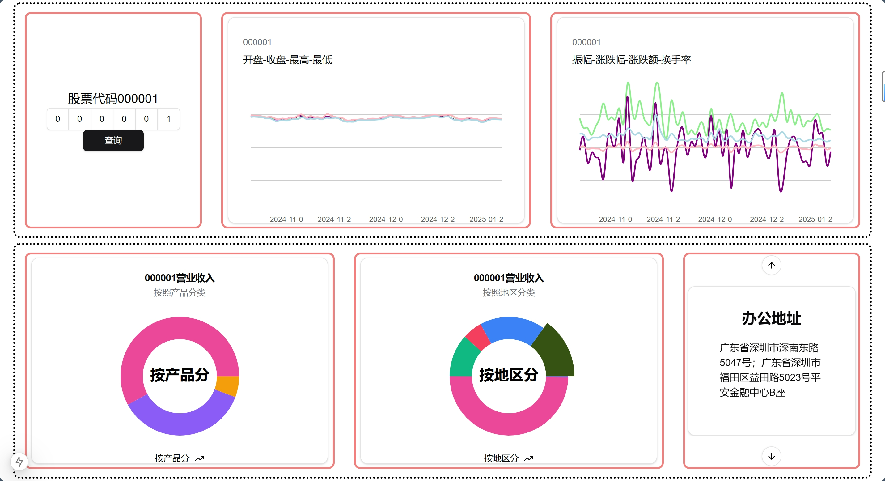
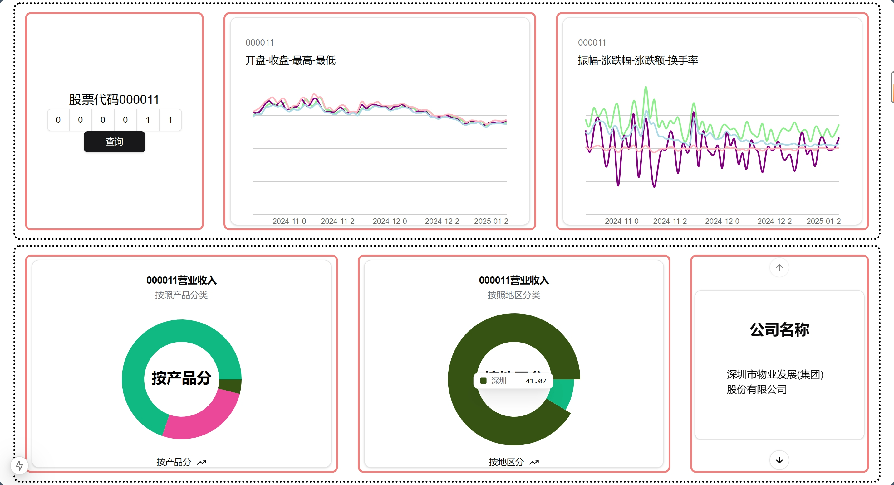

# React for fun
## 数据看板
- 前端组件采用shadcn
- 后端fastapi
- 对于按钮，采用`laoding`state在submit和loaing按钮中二选一进行渲染。`{loading ? disabledbutton : submitbutton}`

## flex布局
后端传入随机数

## 数据看板
- 为避免后端请求数据库等的延时，在通信未结束时，按钮会不能再被点击。
- 采用`q`和`tq`两个状态常量。tq用于读取输入，q用于后端查询。采用useEffect监听q的变化

    <iframe src="https://player.bilibili.com/player.html?isOutside=true&bvid=BV1CyVrz6E7e" 
            style="position:absolute;height:100%;width:100%;" 
            allowfullscreen="allowfullscreen"
            frameborder="no">
    </iframe>

